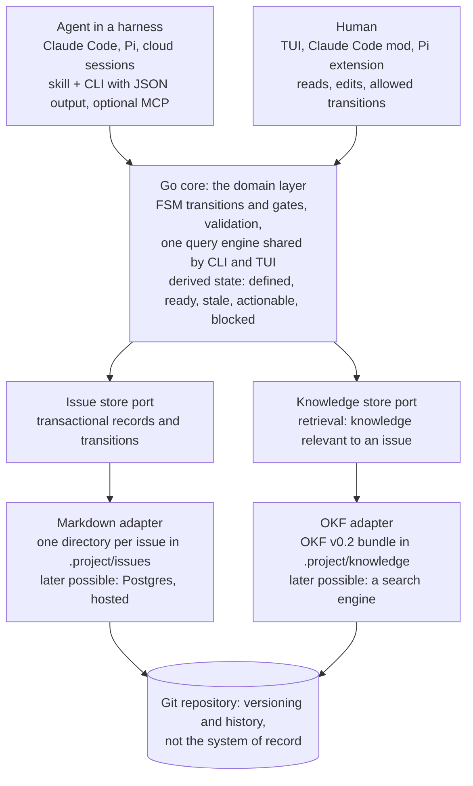
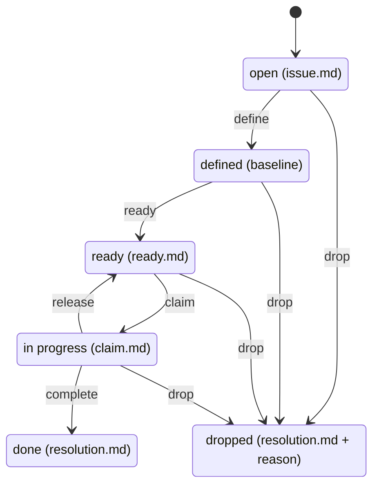

# prep — Design

As of 2026-10-05 · Andre

> **Frozen historical snapshot.** This document was imported into prep when the first implementation slice ran: decisions, stack and architecture now live as knowledge entries in `.project/knowledge/` (start at `overview.md`), and the remaining work and open points are open issues in `.project/issues/` (`prep list`). Do not update this file; change the knowledge base instead.

## Purpose

prep is a workflow engine and memory for coding agents, with a human supervising: it enforces the steps an issue goes through and holds the context agents need to implement it. It is not a traditional project planning tool.

The name comes from cooking: like mise en place, everything an agent needs is prepared before the work starts. The binary and every command use the same name, for example `prep guide <id>`.

The problem it solves: many personal coding projects sit in different states of done, and agents implement poorly when requirements, decisions and context are scattered or missing. prep keeps all of that in the repository, versioned with the code, so the data documents both the state of the project and why it got there.

The core value is the lifecycle of an issue: a short requirement is first defined, then enriched with context, decisions and acceptance criteria, and only then implemented. The system enforces that order; how the work inside each step happens is up to the user and the agent.

In short, prep is change management for agent-built projects: issues record what should change and what changed, and the knowledge base records what is true now. The documentation step at resolution connects the two, so every completed issue moves the knowledge base from one state to the next.

## Design principles

1. **The system enforces steps, not how work happens.** It defines what each step must produce and the gates between steps. Working style (sparring, interviewing, drafting) belongs to the user and the agent.
2. **Write permissions belong to the harness.** Claude Code, Pi and others already ask before running commands; prep does not add its own approval mechanism. It gives agents and humans different interfaces to the same data.
3. **It is a small database.** Store every fact that cannot be derived; never store anything that can. State, progress, blocked and actionable are computed.
4. **Every transition leaves a record**, in the file that represents it, so no fact depends on git history surviving squash merges or shallow clones.
5. **Files never move.** An issue lives at `issues/<id>/` forever; hierarchy and state come from frontmatter and records, not locations.
6. **Storage and presentation are decoupled.** The files are the storage engine, git provides versioning, the CLI and TUI are the query interfaces. Raw files are not meant for browsing.
7. **Domain and storage are separate layers.** Markdown is the first storage adapter, not the definition of the system.
8. **Keep it simple; no premature optimization.** Scan all files on every run, add caching only when proven necessary, and defer anything not needed for dogfooding.
9. **Issues record change, the knowledge base records state.** Every completed issue moves the knowledge base forward through the documentation step at resolution.

## Architecture

One Go binary holds the domain layer; agents and humans reach it through different interfaces, and storage sits behind ports so markdown is only the first adapter.



- **Harness-first interaction.** Work and conversation happen in the agent harness as today. The TUI runs alongside, live, for reading and editing. The files connect them as a shared database.
- **The CLI is the agent interface**, with JSON output; MCP is optional. Any harness with a shell can use it.
- **Adapters are thin** on both sides: harness integrations (Claude Code mod, Pi extension) and storage adapters contain no FSM logic.
- **Separate ports for issues and knowledge** because their access patterns differ: transactional state versus retrieval.
- **Guarantees git provides today** (history, branch-scoped review) must be provided differently by a database adapter; the domain layer assumes neither.

## Stack

prep is written in Go, with the Charm ecosystem for the TUI. The core, CLI and TUI share one codebase and one binary.

| Part | Choice | Role |
| --- | --- | --- |
| Language | Go | single static binary, near-instant startup for frequent agent calls, simple install |
| App structure | Bubble Tea | Elm architecture; file-change events drive the live view |
| Components | Bubbles | filterable lists for query views, text area for inline editing, viewport for long records |
| Layout and styling | Lip Gloss | tabs, panes, detail view |
| Markdown rendering | Glamour | issue records in the detail pane |
| Third-party storage adapters | JSON-RPC over stdio | language-neutral, like LSP and MCP; the core stays a closed, tested binary |
| Harness adapters | thin TypeScript | only where a harness requires it: Claude Code mod, Pi extension |

Alternatives considered: TypeScript would share code with harness mods but needs a runtime and starts slower, and OpenTUI is not production-ready. Rust offers no decisive advantage here and would slow iteration during dogfooding.

## Data model

All data lives in `.project/` inside the repository, with one directory per issue that never moves. There is a single record type: what was earlier called a goal is simply an issue with children.

```
.project/
  project.md            # project-level Definition of Done, schema version
  config.yaml           # project-level config only
  knowledge/            # knowledge base, OKF v0.2 bundle
  issues/
    20260929-150011/
      issue.md          # frontmatter + requirement prose + open questions
      acceptance.md     # checkable criteria
      context.md        # implementation context
      decisions.md      # append-only decision records
      history.md        # narrative work log
      findings.md       # research issues only
      baselines/        # requirement snapshots; newest marks "defined"
      ready.md          # sign-off, references the baseline it was enriched against
      claim.md          # present while work is in progress
      resolution.md     # present once done or dropped
      attachments/      # free-form files
```

**IDs** are UTC timestamps (`YYYYMMDD-HHMMSS`), like database migrations: immutable, collision-free without coordination, and equal to the directory name. Any unique suffix works as a short form. `prep new` generates them; agents never invent them.

**Frontmatter** in `issue.md` holds all metadata: `title`, `kind`, `parent`, `depends_on`. Everything except the ID can change without breaking anything. Metadata never appears in other files.

**Relations**

| Relation | Stored as | Guarantees |
| --- | --- | --- |
| Parent / children | `parent` field on the child | one parent per issue; lint checks existence and no cycles |
| Dependencies | `depends_on` list on the dependent issue | lint checks existence, no cycles; "blocks" is computed, never stored |
| Child depends on own parent | not allowed | lint error (deadlock) |

**Who writes what.** The requirement in `issue.md` is the only human-authored input. Acceptance criteria, context and decisions are derived from it during enrichment. Records like baselines, ready, claim and resolution are written by prep commands.

**Schema files are fixed** per schema version and per kind; unknown top-level files are errors. A `schema` field in `project.md` plus `prep migrate` handles format changes.

## Issue lifecycle

Every issue moves through a fixed state machine, and no state is stored: each is derived from which records exist.



Stale is a computed overlay on defined and ready issues: the requirement or kind differs from the newest baseline. Stale issues are excluded from `prep next`.

**Kinds** are a closed list built into the FSM; they set the completion rules for leaf issues.

| Kind | Completes | Evidence required | Enrichment |
| --- | --- | --- | --- |
| `code` | agent only | git commit reference | required: context from the codebase |
| `manual` | user, in the TUI | none beyond acceptance criteria | optional |
| `research` | agent or user | `findings.md` | the question, scope, and what counts as answered |
| `decision` | agent after agreement, or user | an outcome entry in `decisions.md` | the question and the options |

Kind is chosen at creation and can be edited later. Research and decision outcomes flow into dependent issues through `prep guide`, without copying.

**Parents.** An issue with children is a parent, derived from the children's `parent` fields. Its kind is kept but ignored while it has children. A parent is not implemented itself: it completes when all children are done or dropped and its own acceptance criteria are checked.

**Dependencies.** An issue cannot be claimed while any dependency is unresolved; depending on a dropped issue is flagged. **Actionable** = ready, not stale, dependencies done, unclaimed.

**Definition of Done** cascades project → parent → child and is computed, not copied. Explicit opt-outs are allowed, and the effective DoD is snapshotted into `resolution.md`.

**Documentation decision.** Completing any issue also requires a documentation decision in `resolution.md`, recording which knowledge entries changed or why there was no impact (see Knowledge base).

## Define, enrich, and drift

Preparation happens in two phases with different jobs, and the system enforces only their outputs and gates.

| Phase | Settles | Authority | Output | Gate |
| --- | --- | --- | --- | --- |
| Define | what and why | the user | requirement prose with no open questions | writes a baseline snapshot |
| Enrich | how | agent drafts, user agrees | `context.md`, `decisions.md`, `acceptance.md` | writes `ready.md` referencing the baseline |

Code may be checked during definition when it tests whether a requirement makes sense; that serves the requirement, not the implementation. Requirements are free prose plus an **Open questions** section; a requirement can only be marked defined when that section is empty. Issues can be defined and enriched anywhere in the tree, including top-level standalone issues.

**Drift detection.** Context and decisions are derived from the requirement, so each records which version it was built from. Defining writes `baselines/<timestamp>.md` (who, when, the requirement text). If the requirement later differs from the newest baseline, the issue is stale, and any `ready.md` pointing at an older baseline is invalid. Kind is part of the baseline, so changing it also makes the issue stale.

A stale issue is resolved in one of two ways:

- **Acknowledge:** the change is trivial (a typo, rewording). A new baseline is written without re-enrichment.
- **Re-enrich:** the change is real. Context and acceptance criteria are updated, new decisions appended, superseded ones marked (`supersedes: <entry>`), never deleted.

Editing acceptance criteria by hand does not make an issue stale; only the requirement and kind are baselined.

**Decisions** are append-only, dated entries with rationale and alternatives considered. Superseding keeps the full why-trail.

## Agent interface

Agents interact through the CLI, which is the primary agent interface; MCP is an optional convenience wrapper. Every read command supports `--json`, and errors and diagnostics are JSON with stable codes.

**Read and write commands are strictly separate**, so harness permission rules can allow reads freely and ask before writes.

| Command | Purpose |
| --- | --- |
| `prep prime` | small, capped session-start briefing: top-level parents with progress, actionable count, alerts (stale, claims, check failures). Pointers, not content |
| `prep guide <id>` | step contract for an issue: current state, possible transitions, unmet gate conditions, input pointers including candidate knowledge entries, where outputs go |
| `prep list` | queries via flags: `--state ready --kind code --under <id>`. Different flags AND, repeated flags OR |
| `prep next [--under <id>]` | actionable issues: ready, dependencies done, unclaimed |
| `prep show`, `prep check` | read one issue; validate the whole tree |
| `prep new`, `define`, `ready`, `ack`, `claim`, `release`, `complete`, `drop` | write commands, one per transition |
| `prep fmt`, `prep fix`, `prep migrate` | maintenance writes: canonical formatting, safe auto-fixes from check, schema migrations |

**Context layering.** Prime at session start, then guide for the chosen issue, then the issue's files. Each layer points to the next, so nothing large enters the context unless the work needs it.

**The skill** is a tiny pointer that tells agents to use `prep guide`; the real instructions come from the binary and always match its version. A static copy serves environments without the binary, such as cloud sessions. Skills are the portable cross-harness standard; plugins are harness-specific.

**Harness adapters are thin.** They call the CLI with JSON and render results, with no FSM logic of their own.

- Claude Code: skill, SessionStart hook for `prep prime`, slash commands, later a mod with a pane and commands.
- Pi: an extension with commands and a status widget.
- Cloud sessions: files plus skill work without the binary; the binary can be installed through a SessionStart hook.

## Human interface: TUI

The TUI is the human client to the data: reading, editing and a subset of transitions. It runs next to the harness and updates live by watching the files. A Claude Code mod and a Pi extension are offered as well; usage will show which works better.

**Query-first layout,** like lazygit or k9s. The same query engine serves the CLI and the TUI, so both agree on what "actionable" or "stale" means.

- **Saved views as tabs**, each a stored set of flags: Attention, Actionable, In progress, To enrich, To define, All. Custom views live in the project config.
- **Filter bar** accepting the same flags as `prep list`.
- **Tree toggle**: any result can be shown flat or with its ancestors.
- **Detail pane** with the issue's records, a diff view for stale issues (requirement vs baseline), the check output with fixes, and a settings screen for the project config.

**Editing** works in two modes, both supported: inline in the TUI, or opening the file in `$EDITOR` with validation on close.

**Transitions in the TUI** depend on kind and state.

| Transition | Code issue | Manual / research / decision |
| --- | --- | --- |
| Create, reparent, edit requirement | yes | yes |
| Complete | no, agent only, with commit evidence | yes |
| Drop (with reason) | yes, any state | yes, any state |
| Acknowledge a stale change | yes | yes |

**Starting work on an issue** happens in the harness. Copying an issue ID and telling the agent is the minimal flow; better DX (picking issues in a mod or extension) comes later.

**Knowledge in the TUI** is small and serves the issue workflow; it comes after the issue views are working, since agents use the knowledge base through `prep guide` before it can be browsed.

- **Issue detail:** entries linked from the issue's context, and for finished issues, the entries its resolution changed.
- **Knowledge view:** the same query engine with flags (type, status, trust tier, scope); a filterable list of title, description and status, the rendered entry in the detail pane. Read-mostly; editing via `$EDITOR`.
- **Attention view:** entries flagged by the drift check, drafts awaiting review, broken links.
- **Review at completion:** knowledge changes shown alongside the other content changes, approved in one pass.

## Integrity and operations

The system should heal itself, or lead the user to healing.

- **Validation in two places:** every tool write validates before writing, so the tool cannot produce invalid state; `prep check` validates the whole tree afterward and catches hand edits and bad merges. CI runs `prep check` as the backstop.
- **Diagnostics in three classes,** each with a stable code and fix description: auto-fixable (formatting, missing empty schema files) repaired by `prep fix`; guided (duplicate IDs after a merge, orphaned claims) with options explained; manual, with a clear explanation.
- **Canonical format,** like gofmt: stable frontmatter key order and section order. `prep fmt` normalizes; CI checks it. One field per line keeps diffs small and merges clean.
- **Atomic writes** via temp file plus rename. Concurrent writers (TUI and agent) use compare-and-swap on the content hash read earlier.
- **No index or cache.** All files are loaded on every run. Any future cache must be gitignored and fully rebuildable.
- **Contract tests:** a corpus of valid and deliberately broken trees that `prep check` must accept or reject. It doubles as the format specification's examples and later as the test suite for any storage adapter.

**Git.** Git is versioning, not the system of record: every fact the system relies on is in a record. Since files never move, there is no `git mv` and no rename detection to protect.

**Config** is project-level only, in `.project/config.yaml`, editable from the TUI settings screen. This avoids collaborators with conflicting settings. User-level config can be added later if dogfooding shows a need.

| Setting | Values | Notes |
| --- | --- | --- |
| Commit mode | `off` (stage only), `all` (one commit per tool operation) | the tool only ever commits `.project/` paths; default still open |
| Saved views | named flag sets | shown as TUI tabs |

## Knowledge base

The knowledge base documents the current state of the project for agents, while issues record change. Agents write it, and it follows Google's [Open Knowledge Format (OKF) v0.2](https://github.com/GoogleCloudPlatform/knowledge-catalog/blob/main/okf/SPEC.md) as closely as possible, adopting OKF best practices as they emerge rather than prep's issue conventions. It replaces the earlier lessons-learned idea.

| Layer | Records | Example |
| --- | --- | --- |
| Issues | change: what was requested, decided and done, and why | "switched the export to streaming" |
| Knowledge base | state: what the project is now | "the export streams rows; the parser drops rows without a price" |

**Principles**

- **Agent-facing.** Written by and for agents, optimized for retrieval. Human-facing docs can be generated from it later; that is out of scope for now.
- **Current state only.** Stale information is deleted, not deprecated; its history lives in the issue that changed it.
- **Precedence when sources disagree:** code over knowledge base over old issue decisions. An agent that finds a contradiction fixes the stale entry in the documentation step.
- **Project-wide decisions live here** as decision entries stating the current choice and linking to the issue where it was made. Pitfalls become part of the entry they concern instead of a separate list.
- **Entry types** (OKF `type`): feature, component, decision, convention, pitfall. One concept per entry, kept small; lint warns above a size threshold.

**Format (OKF v0.2)**

- `type` is required; every entry also carries `title` and `description`, because the description is the triage layer `prep guide` lists.
- `generated: { by, at }` uses the OKF actor convention (`<producer>/<version>` for agents, `human:<id>` for people). `verified` events give OKF trust tiers; approval at completion makes an entry human-reviewed.
- `status` is `draft` or `stable`; `deprecated` is unused because stale entries are deleted.
- `resource` and `sources` point at the code paths an entry describes.
- Custom keys, which OKF explicitly allows: `scope` (paths or globs the entry applies to) and `confirmed_commit` (the commit at which it was last checked against the code).
- Concept IDs are readable file paths, links are bundle-relative (`/components/export.md`). Entries are never renamed, and lint checks that links resolve, since OKF itself tolerates broken links.
- `index.md` is generated for progressive disclosure; `log.md` is not used.
- Bodies use structural markdown, precise references (paths, symbols, commands), an explicit statement of when the entry applies, and dense links to related entries.

**Context resolution.** `prep guide <id>` lists candidate entries by title and description only; the agent opens what it needs and follows links from there. Entry points, in order:

1. Entries linked from the issue's `context.md`, set during enrichment.
2. The parent chain's context and linked entries.
3. Entries whose `scope` overlaps the files the issue touches.
4. The project overview entry, which links to everything else.

Backlinks such as "which issues changed this entry" are computed from resolution records, never stored.

**Lifecycle**

- **Documentation step at resolution.** Completing an issue requires a documentation decision in `resolution.md`: the entries updated or created, or "no impact" with a one-line reason. Lint checks that referenced entries exist. prep enforces that the check happens, not what is written.
- **Drift check.** `prep check` flags entries whose scoped paths changed since `confirmed_commit`. The git comparison lives in the storage adapter.
- **Bootstrapping.** An initial survey, run as a research issue, maps an existing project into `draft` entries that become `stable` once reviewed.
- **Maintenance.** An occasional knowledge-review research issue handles duplicates and overlap.
- **Branches.** The knowledge base is versioned with the code, so each branch's knowledge matches that branch's code.
- **Writes during implementation** (history entries, checked criteria, knowledge entries) are free and reviewed as a batch at completion.
- **Own storage port,** built around the retrieval query, so a search-engine adapter is a natural later option.

**Scope boundary.** prep owns only what the workflow needs: the format conventions and lint, retrieval through `prep guide`, the documentation gate, and the drift check. A knowledge editor beyond `$EDITOR`, graph visualization and publishing come from the OKF ecosystem, since the bundle is standard markdown with frontmatter that other OKF tools and editors such as Obsidian can read.

## Prior art

The task-tracking layer is largely solved by existing tools; what is new here is the define/enrich lifecycle with drift detection, structure-derived state with a record per transition, and the agent-maintained knowledge base. Neither tool below covers those, as far as their documentation shows.

| Tool | What it does | Taken | Avoided |
| --- | --- | --- | --- |
| [Backlog.md](https://github.com/MrLesk/Backlog.md) | markdown tasks in the repo, CLI, MCP, terminal Kanban, acceptance criteria, Definition of Done | instructions served by the binary; project-level Definition of Done; dogfooding | titles in filenames; status as a field; scanning branches to show cross-branch state |
| [Beads](https://github.com/steveyegge/beads) | dependency graph, `ready` work queue, claims, hash IDs | session-start briefing (`prime`); JSON output everywhere; contract tests | syncing two representations (SQLite + JSONL); many records in one file |

Spec-driven tools such as GitHub's Spec Kit, Kiro and OpenSpec focus on per-feature spec documents rather than a persistent tracker.

## Out of scope

These were considered and deliberately left out; each can be added later without changing the model.

| Topic | Decision |
| --- | --- |
| GitHub integration | none; completion evidence is a plain git commit reference |
| Cross-project view | single project only; a global TUI scope with project selection may come later |
| Orchestrating implementation | the tool records implementation but never runs agents; parallelism is the harness's business |
| Approval or permission system | harness permissions handle it; no proposal queue |
| Focus or active goal | none; the user tells the agent which issue to work on |
| Goal ordering, priorities | none for now; a roadmap list can be added later |
| How work inside a step happens | user's and agent's choice (sparring, interview, draft first) |
| User-level config | project-level only for now |
| Hosted or database storage | possible through the storage port; markdown adapter only for now |
| Human-facing documentation | can be generated from the knowledge base later |
| Knowledge editing, visualization, publishing | OKF ecosystem tools and `$EDITOR`; prep only browses |

## Open points

- [ ] **Install and update flow:** likely GoReleaser on tag push, GitHub Release binaries, a `curl | sh` installer, and `prep update` self-replacing (deferring to Homebrew or `go install` when installed that way). The Claude Code plugin ships separately through a plugin marketplace and checks binary compatibility. Must be ergonomic and rock solid.
- [ ] **Code completion evidence and squash merges:** a branch commit hash disappears after a squash merge. Accept unreachable hashes as informational, or verify only reachable ones.
- [ ] **Claims across branches:** a claim made on a feature branch is invisible on main until merged. Accept the lag, or have `prep claim` commit and push to main first.
- [ ] **Default commit mode:** `off` or `all`.
- [ ] **Decision entry format** in `decisions.md`, including the outcome marker for decision issues.
- [ ] **Free-form tags:** a `tags` field with no FSM meaning, if needed, so `kind` stays clean.
- [ ] **Knowledge overview and index:** what the project overview entry contains, and whether `index.md` files are regenerated on every write or by `prep fmt`.

## First implementation slice

The first slice is the smallest version that can track its own development, so the next features are built as issues inside the tool.

1. **Core domain** in Go: records, derived states, FSM transitions and gates, validation, the query engine.
2. **Markdown storage adapter:** reading and writing files, canonical formatting, atomic writes.
3. **CLI:** `new`, `list` with flags, `show`, `guide`, `check`, `fmt`, and the transitions `define`, `ack`, `ready`, `claim`, `release`, `complete`, `drop`, all with `--json`.
4. **Minimal skill** pointing agents at `prep guide`.
5. **Contract test corpus** of valid and broken trees.

After that, tracked as issues in prep itself: the TUI (issue views first, then the knowledge view), `prep prime` with the SessionStart hook, the knowledge base with its initial survey, the Claude Code mod and Pi extension, then install and update.

**Bootstrapping prep itself.** The first slice is built from this document directly. Once it runs, importing the document is the first dogfooding test: decisions, stack and architecture become knowledge entries, the remaining work and open points become issues created as open (never defined, so each still passes the define gate), and this document is frozen as a historical snapshot.